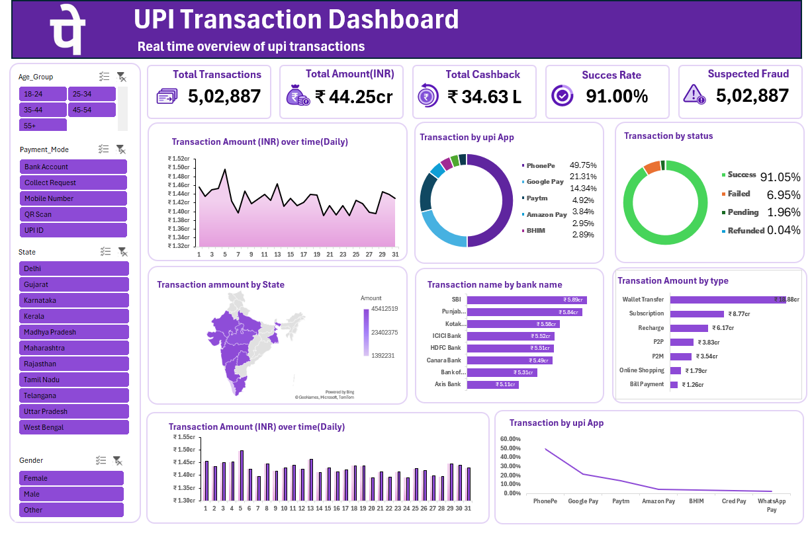

# UPI Transaction Analysis Dashboard

## 📊 Project Overview

This project is an interactive Excel dashboard created to analyze UPI transaction data and identify transaction trends, payment app performance, transaction types, customer segments, and geographic patterns.

## 🎯 Project Objectives

- Analyze overall UPI transaction performance
- Compare different UPI payment apps
- Analyze transaction types and status
- Identify state-wise transaction patterns
- Understand customer segments by age and gender
- Monitor daily transaction trends

## 📌 Key KPIs

- Total Transactions: 5,02,887
- Total Transaction Amount: ₹44.25 Cr
- Total Cashback: ₹34.63 L
- Success Rate: 91.00%

## 🔍 Key Insights

- PhonePe has the largest transaction share at 49.75%.
- Google Pay contributes 21.31% of transactions.
- Wallet Transfer has the highest transaction amount at ₹18.88 Cr.
- The dashboard provides transaction analysis by payment app, status, state, bank, transaction type, age group, gender, and payment mode.

## 🛠️ Tools Used

- Microsoft Excel
- Pivot Tables
- Pivot Charts
- Slicers
- Data Cleaning
- Data Visualization
- Dashboard Design

## 📈 Dashboard Features

- KPI Cards
- Daily Transaction Trends
- UPI App Analysis
- Transaction Status Analysis
- State-wise Analysis
- Bank-wise Analysis
- Transaction Type Analysis
- Customer Segmentation

## 💼 Business Impact

The dashboard helps businesses monitor transaction performance, identify important payment channels, understand customer transaction patterns, and support data-driven decision-making.

## 📷 Dashboard Preview

## 📂 Project Files

- `data/` - Dataset
- `dashboard/` - Excel dashboard
- `images/` - Dashboard screenshot
